+++
title = "Debian Install Guide"
date = 2026-05-19
description = "A reasonable and practical walkthrough for installing Debian on bare metal."

[taxonomies]
tags = ["linux", "debian", "installation-guides"]
+++
#### A reasonable and practical walkthrough for installing Debian on bare metal.

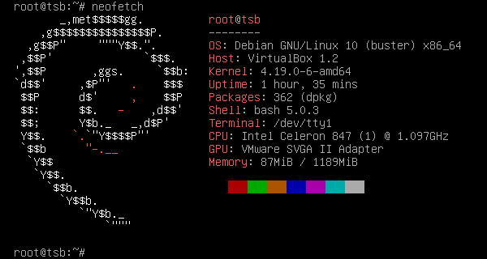

#### Learning Outcomes:
- ☑️ Learn how to create installation media
- ☑️ Learn how to install Debian on a machine without guidance
- ☑️ Learn the basics of filesystem traversal
- ☑️ Learn how to install and remove packages with APT
---
#### Preface
The first thing we must attend to when installing really any operating system, not just Debian, is the creation or purchase of installation medium. If we are creating our own installation medium, it is imperative that we download our .iso file from the genuine distributor's website. A way to confirm you have the actual distribution is to run a check on the .asc files often accompanying the link to the distribution's download. If they come back as being genuine to the author of the project, then you're safe and may continue by flashing the operating system to the drive, CD, DVD, or whatever one of the media is proper to the situation. 

The purpose of this preface is to emphasize the downloading of a correct .iso file when flashing an operating system. There are other questions that arise when choosing your file for download, such as the processor architecture of your computer. While most consumer computers run on an x86 architecture, exceptions such as Apple Silicon, an aarch64 processor, do indeed exist. Simply googling your make and model will reveal this information very quickly. While it may seem finicky to be so certain about which file you download; it's actually of paramount importance for the actual success of the overall process. If you choose an incorrect file, your installation will be unsuccessful; plain and simple. Obviously, that isn't the goal of this guide, so I recommend that you are sure you have the correct .iso file for your computer architecture and from the correct publisher. We will walk you through this where relevant in Debian in the following guide; however, I felt it important to generally emphasize this when discussing the installation of any operating system. 

Overall, the purpose of this guide is to educate you to the point of autonomy when installing Debian, or really most Linux distributions with graphical installers. It should be noted that skills gained here will almost certainly work with the requirements of that system. This includes distros like Ubuntu and Fedora. One of the steps that is both difficult and of paramount importance is drive partitioning, which I will walk you through manually for the purposes of a richer explanation of options such as RAID, as well as preparing you for more complicated distros, like Arch, that require manual partitioning and mounting as part of its installation process.

Thank you for choosing my guide for your installation process; I hope I may be of service.

---
### The Guide

#### Downloading the .iso File

The first thing that we need to do when we are installing Debian is obtain the .iso file from the official Debian distro website. Debian is readily available through the "[downloads](https://www.debian.org/distrib/)" page, or even directly through the [homepage](https://www.debian.org/); although, it should be noted that the homepage download is the x86 netinst version. Please visit the main downloads page should you need a torrent, qcow2, or whatever other version is required for your use case. For our purposes, we will be using the aforementioned x86 netinst version, as it is what is most commonly used for consumer-grade hardware, save for the previously discussed exceptions.

#### Flashing the .iso File

> You may skip this section if you wish to purchase an installation medium from the Debian website; this may be found on the downloads section of the website. This is only recommended if you wish to skip the flashing section and wish to give fiscal support to the Debian project.

Once you have obtained the file, either from the [homepage](https://www.debian.org/) or the [downloads](https://www.debian.org/distrib/) page, we can proceed to flashing the .iso file to an installation medium. For most purposes, a USB stick is highly recommended; however, you may use a CD/DVD, or really anything that can transfer data to a target machine. For a USB stick, the program we are going to be using is a free and open-source piece of software called _[Balena Etcher](https://etcher.balena.io/#download-etcher)_. Etcher can be used to flash any operating system to any USB medium, from sticks to external drives; just as long as it's bootable. 

The first step to take when flashing the operating system is to open Etcher and then select the target medium, which, in our case, is the attached USB stick. Then, we select the operating system, or .iso file, of our choice. After selecting Debian, we can select the "flash" button to the far right. Below is an example photo of what you might see when you boot up Etcher and flash a drive. 

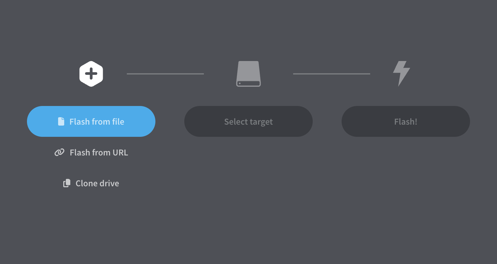

"Flash from URL" and "Clone Drive" are both options, in case you want to flash from network or clone a pre-existing drive, and we will briefly explain them here. To flash from URL is to download the .iso file from a URL from the internet while flashing it at the same time. If you wish to try this with Debian, you can use this [link](https://cdimage.debian.org/debian-cd/current/amd64/iso-cd/debian-13.5.0-amd64-netinst.iso) (copy this link, do not click it). If you already have a Debian drive and wish to make another, you can insert a "source drive" to use as the base for the clone. 

#### Booting into the Debian Graphical Installer

After having created a bootable drive by using Etcher, we can now install Debian on our PC. However, in order to do so, we first need to boot into Debian’s installer screen. This can be accomplished via a number of ways, depending on the hardware that you are using. My recommendation is to repeatedly press the ```esc``` button until the boot options appear. Repeatedly pressing the key will generally result in a list of options that can be selected using a button such as ```f10```. 

If you choose to go into the BIOS itself, you will notice a section labeled as “boot” or you will notice the boot order immediately upon booting into it. The boot order will likely present the current system as the first option for the boot order. It is not necessary to change this, as you can manually select the bootable drive in the boot manager; however, you can change it if you want to directly boot into it upon restarting the BIOS, should you make any changes. It should be noted that you should only make changes to the BIOS if you know what you’re doing and have a specific prerogative to do so.

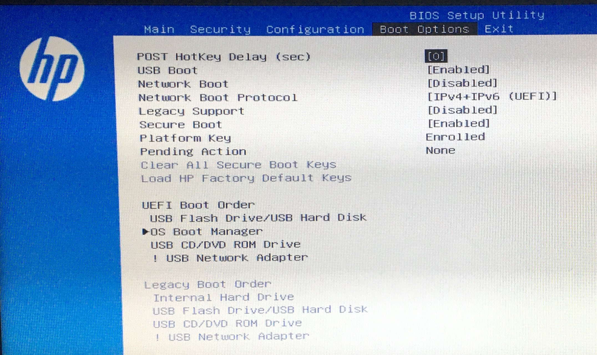

Once we have found the proper button to press, be it ```f10``` or ```f12```, we can now boot into the installer and upon doing so, we will be greeted with a variety of options, including the option of our interest, “Graphical Installer.”

#### Selecting Language, Location, and Keyboard
- **Language:** Selecting a language, the first step of installation, is surprisingly important for the rest of the installation. If you choose a language you are unfamiliar with, you will have a hard time installing anything later; “it’s all Greek to me” may become a literal problem. Not only does this affect the installer language, but it affects locale for the system later on, which can affect applications and other system settings that would have to be manually and individually changed later. Make sure you select the correct language.
- **Location:** Similarly to language, this is surprisingly important, as this will influence how Debian selects mirrors (servers that provide OS install information), as well as you time zone, and other locale behaviors. When selecting your location, make sure it is as specific to your actual location as possible.
- **Keyboard:** Selecting a keyboard is relatively simple, as the typical QWERTY, US keyboards are labeled quite obviously, alongside other keyboards such as the German QWERTZ, including characters specific to the German language. This is similar for all other keyboards listed. If you are unsure of the correct keyboard, please make sure to look it up to confirm it, as this can affect your ability to type in usernames and passwords later in the install process and after.

#### Detecting Hardware and Loading Installer Components
At this point, Debian is beginning to detect the local hardware, and then deciding what it needs to support in order to install the main system. If you’re missing firmware for certain hardware, it may let you know this; at this point it also loads pieces of the installer for the hardware peculiar to your system. This is an important step, as Debian needs to know what kind of hardware it will be utilizing.

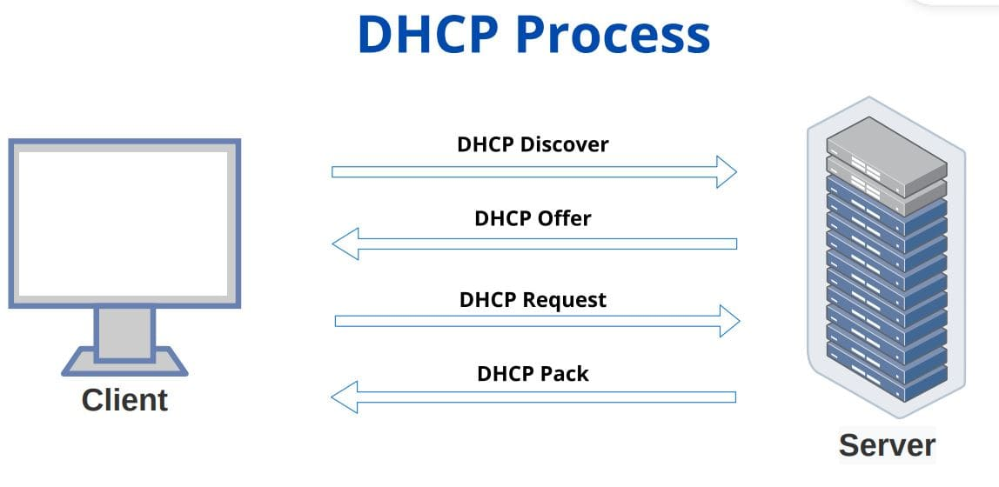

#### Configuring the Network

> When configuring the network, the first thing Debian tries is DHCP, or the Dynamic Host Configuration Protocol. DHCP is a method of assigning a dynamic IP and other configuration parameters to your device by communicating with the router, which manages a pool of IP addresses for assignment. DHCP is “client-server,” and hosts are assigned IPs “dynamically,” or as the hosts join the network.
 
When you proceed to this step, your device is joining the network as a Debian device, requiring an IP to be assigned before it can communicate with the broader internet. As we have discussed the installer will use DHCP if possible; however, if your router either doesn’t have a DHCP server pool, or can’t connect to it, you will have to enter a manual network configuration, which can be quite the Sisyphean task for the average user. For this reason, it is recommended that you directly connect your device to your router with an RJ45/ethernet cable for at least the installation period. 

If this step fails during a netinst installation, Debian may not be able to download the packages needed to complete the install. Internet connection during installation should be stable and reliable in order to prevent any issues later on during the actual installation and configuration of the OS and your selected desktop environment/applications. 

#### Setting the Hostname and Domain Name
Next, the installer will prompt you to enter the hostname you want for the device. The hostname is the name the device will use on the network, appearing as something like “debian-pc,” or “johns-desktop.” This is somewhat important, depending on what you plan to do with your machine. If you wish to use SSH in the future, it will serve as a human-friendly nickname that can be used to connect to the device’s shell. When you enter the hostname, it’s important to use something memorable and descriptive. Doing so will make accessing the shell easier.

After this, the prompt for the domain name will appear. For most people, especially beginners, this step can essentially be skipped. However, if you plan on making a homelab, managing a web host, or some kind of enterprise-grade network, this will become more important. If you own a domain name that will be used by the target machine, make sure to enter it here.

#### Creating the Root Account
The root account is the most important account on your machine. Not only does the root account have access to the entire filesystem, but it also has the ability to download packages, and do anything else that would be expected of a superuser on a computer. You may or may not be familiar with the ```sudo``` command (superuser do), and the main difference between an account with sudo access and the root user is scope of administration. It is realistically smarter to actually have no root account enabled on a personal machine, whereas it is important to for something that will utilize more traditional administration. The way you can give your actual user the ```sudo``` ability while having no root account and tightening up your administrative scope, is by simply leaving the root password blank when prompted in the installer.

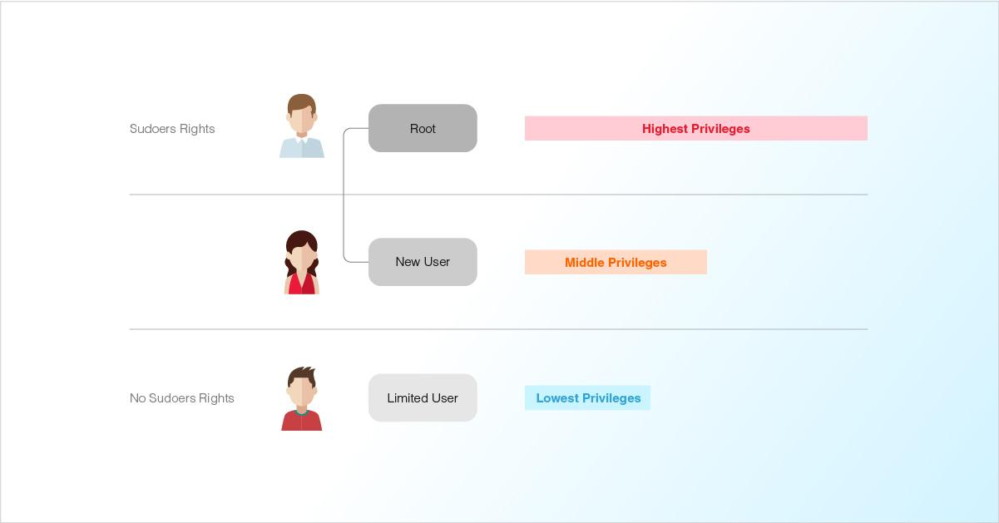

#### Creating your User
When creating your user, you will have to enter your name, username, and a password. It is recommended that you use a strong password of at least 12 characters that make up an alphanumeric string, rather than an actual word. Using techniques like leet-speak (1337 = LEET) are essentially moot in the world of modern password cracking software; you want randomness and entropy. KeePassXC, or any other KeePass fork, has a password generator that displays the entropy of your password, representing how many billions of years in would take to crack your password. Simply put: the more entropy the better. A random string of 12 characters can be easily memorized if you don’t think of it as something your memorize like a word, but rather as muscle memory on your keyboard. The random string will become simple when you turn it into a basic game of keyboard gymnastics. 

Having a non-root user is also better for daily tasks. Using a shell that isn’t permanently in root will help add an extra layer of security, as your password will need to be entered upon each usage of the aforementioned ```sudo```. Having only limited root privileges will result in a hardened (or safer) system. Root users can change or delete anything. Lacking a root user, or at least defaulting to a non-root user, will be the best adjustment to make for risk when it comes to a system breach.

#### Configuring Clock and Timezone
While it may not seem the case, your clock and timezone matter more for your system than just the clock it displays. In fact, it matters for package installation, PGP/GPG certificates, and general troubleshooting of your system. If you have an incorrectly configured clock and timezone, it will become infinitely harder to troubleshoot issues, especially system processes. 

When configuring your clock and timezone, the process is quite simplistic; however, you may not be used to the specific format that Linux uses to determine timezones. For instance: Austin, Texas would be “America/Chicago.” Boston, Massachusetts would be “America/New_York.” Essentially, you’re using a region and an approximate city as the template for your input. 

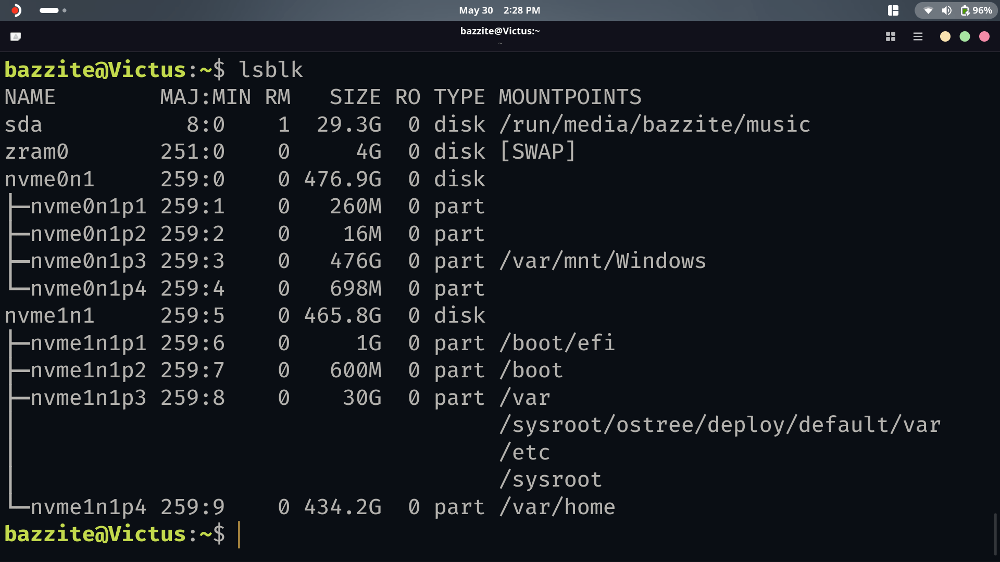

#### Partitioning Disks

>A disk is a physical drive that contains your data. It can come in many forms, including HDDs or hard disk drives, SSDs or solid state drives, or even built-in drives like eMMCs, embedded multimedia cards. When partitioning, you’ll have to select the disk that you want to overwrite and use for Debian. It may appear as something like ```/dev/sda```, if you have a single drive, with more drives, continuing alphabetically. It may also appear as ```/dev/nvme0n1``` if you have an NVME drive. The drive name is dependent upon what hardware you use, so it never hurts to look it up to confirm if you’re confused.

> A partition is an isolated section of a disk that acts on its own. An example of a partition is when someone will use a “dual boot” operating system, or two operating systems on the same disk. There are two operating systems on the same disk, meaning each partition acts autonomously. When you partition a disk, you separate a part of it from the rest of it. Different partitions can have different purposes as well; an interesting example of this is swap, which acts as RAM in case of actual RAM exceeding its maximal capacity.

When partitioning disks in Debian, you will be presented with several options on how to partition it. There is an option for beginners that will be labeled as such in the installer: ```Guided - Use Entire Disk```. However, you can section off different partitions for different parts of the filesystem. You can also manually partition your disks if you have a more unique setup. In the video, I use a manual setup in order to demonstrate RAID, which is a special way to partition your disks. RAID0 improves performance between the two disks, allowing for better read/write speeds; RAID1 allows for mirroring of data across disks; in IT, this is called redundancy. Knowing about these options may not necessarily apply to you, but when it comes to computing, knowledge is power.

Again, for yourself, it is likely best to pick ```Guided - Use Entire Disk```.

#### Choosing Partition Layout

> When choosing a partition layout, a few questions should come to mind: ‘How should the system be divided?’ ‘Why should it be divided that way?’ ‘Does any part of the system need special protection, such as encryption?’
>
> For most beginner desktop installs, the simplest layout is best. Debian needs a root filesystem, written as `/`, where the operating system is installed. You may also choose to create a separate `/home` partition for personal files, and Debian may create a swap area for virtual memory.
>
> LVM becomes more useful when you need storage flexibility. Instead of locking yourself into fixed partitions, LVM lets you create logical volumes that can be resized or reorganized later. This is especially useful on servers, homelabs, and NAS systems where you may eventually add more disks or change how storage is allocated. For an average desktop user, however, standard guided partitioning is usually simpler.

Creating partitions for things such as your ```/home``` can allow users to divide up personal files from other system files in the root directory. This isn’t necessarily recommended for beginner users, but it can be accomplished using the graphical installer as another option, as well as the ```/var``` directory.

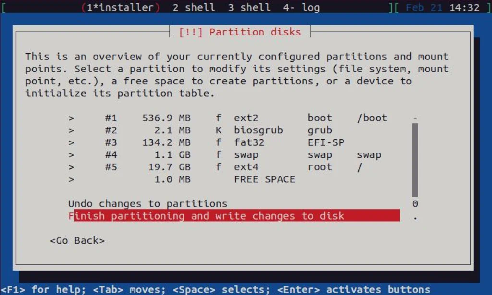

#### Finishing and Confirming Disk Layout
This is the point at which the installer will ask you to confirm a summary of your disk setup. This is the last actual checkpoint at which you may change your partition layout. It is important to actually read the summary and check to see if it is actually what you intend. While the Debian installer does have a few checks while manually partitioning, it cannot prevent you from overwriting important data on your disk beyond reminders. 

Once you confirm the layout, the wizard will begin to partition the disks. This is when you’ve crossed the Rubicon when it comes to overwrites. After the wizard finishes partitioning the disks, you’ll be able to proceed with the installer. However, it should be noted that this may take a moment. Don’t worry, your installer isn’t broken.

#### Installing the System, the Package Manager, and Selecting Software
While this part is fully automatic, it is still important to understand what’s going on under the hood. It is at this point that Debian is installing the base system that it needs prior to installing _APT_, the package manager. Using the package manager, Debian can install the more familiar applications to the system, such as desktops, tools, and other packages. 

After this, the package manager will be installed. It will ask whether you want to use a “network mirror,” which refers to a mirrored version of the operating system that will be installed over the network. For almost all users, this is the correct option to select. At this point, you will select the network mirror that will best suit your locality. Depending on the country you previously selected, a certain mirror will be recommended to. It will be a hostname beginning with “ftp,” or “file transfer protocol.” Mirrors exist for countries as far flung as Australia and Brazil, making it likely that there is a mirror ready for you. Finally, it will ask you to participate in the package manager survey. “No” is selected by default, and neither option is necessary.

> A package manager is a piece of software utilized by Linux to install external software to the machine. Be it security updates or even some games, you can install a lot using your average package manager. Package managers are typically curated and not every application is necessarily available on them by default, or even at all. However, many package managers are extensible, allowing for other repositories to be added, and with that, new suites of applications.

Selecting software will include installing your desktop environment and other system utilities such as SSH (Secure Shell) and the _Apache_ webserver application. Apache will allow you to host a website at port 80 on your computer, as well as 443 for web apps with SSL certificates. While web servers are far beyond the scope of this guide, it’s worth mentioning it as a software option. As for desktop environments, we are going to go over them one by one:

> GNOME is the most aesthetically polished and “macOS-reminiscent” of the DEs. It has smooth animations, matched color palettes, and modern application icons. Interestingly, it isn’t the most resource-intensive of the three major DEs that we will be covering. It’s more the middle-ground between KDE and Xfce when it comes to its resource usage.

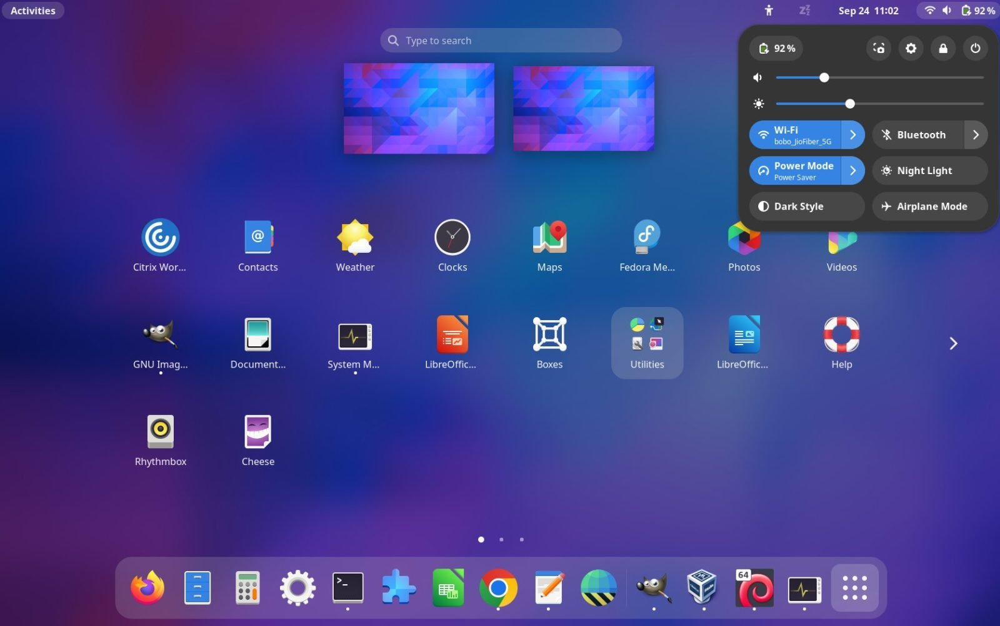

> If you want something that looks almost identical to Windows, KDE is your go-to. KDE is similar to gnome in the sense that it is also quite smooth and modern, it lacks the animations and certain “shine” that GNOME comes with. However, KDE contains many more applications available upon install, as well as mobile connectivity for Android phones via KDE Connect, an app available as an .apk or via the _F-Droid_ store.

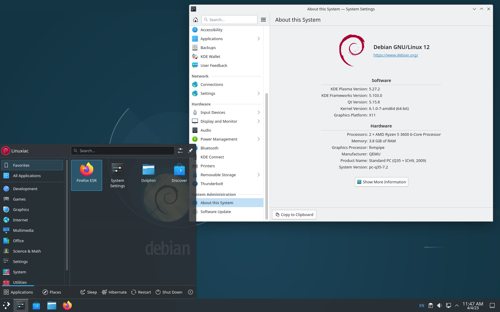

> The least resource intensive of the bunch, Xfce is also similar to Windows in certain regards, but is more unique in its footprint. A favorite of those who wish to extend the lives of elder PCs, Xfce is a great choice for those who wish to save resources while still maintaining a user-friendly experience.

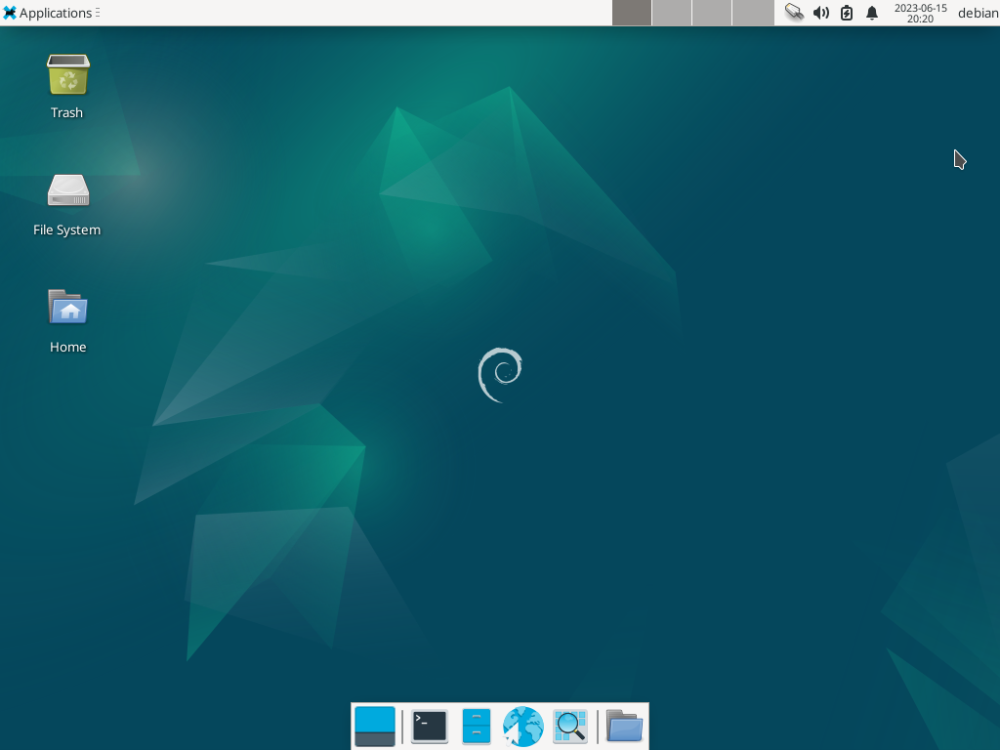

#### Installing GRUB
GRUB, or the _Grand Unified Bootloader_, is what is called a “bootloader,” or what allows Debian to communicate with the firmware upon boot. It allows a hand-off from the firmware to the actual operating system. Upon start, the system firmware, the BIOS discussed earlier, is what becomes operational, without knowing where the actual operating system is. GRUB helps give that control of the system to the Linux kernel, upon which you’ll see a long list of system applications that will start up, allowing for Debian to start and present you with your login. In short, GRUB is triggered by the firmware and finds your Debian install, allowing it to start.

Installing GRUB is a very important step, because without GRUB or another bootloader, the installation may be present on disk, but the firmware may not know how to start it. It’s mostly an automatic step, so there’s not much to mess up, but it’s still important to confirm you have installed it. 

#### Finishing Installation and Rebooting
As with installing any operating system, you’ll have to reboot your system after completing the installation. Debian will run a few checks and clean up after installing, which is another automatic process. When the installation completes and you’re beginning to reboot, you’ll notice that a lot of other system checks are being run by the system. This is nothing to worry about, and will happen every time you shut off or reboot the system. After installation, remove the installation medium during the reboot, so as the system will automatically boot into Debian, instead of the installer. 

#### Post-Installation Sanity Checks
After installing any Linux operating system, not just Debian, the first thing you should do is check for and install updates to your new system. On Debian, the command is as follows:
```bash
sudo apt update && sudo apt upgrade -y
```
Breaking down this  command, we first use “sudo” or “superuser do,” followed by “apt” or “APT,” a package manager that is native to Debian. Now, at this point, you’ll notice that the two sides of the command aren’t symmetrical. One side says only “update,” which simply fetches updates for the system via the standard or added repositories. The other side installs those updates. The “-y” simply confirms that you want to install those updates.

After fetching and installing updates, you should now do what I call “sanity checks” for your system. If still using ethernet, make sure that you can access the greater internet through the terminal using:
```bash
ping -c 3 1.1.1.1
```
This pings Cloudflare 3 times. If it succeeds all 3 times, your system’s network is up. You can also perform this check if you are connected to WiFi. 

Next, check the display, audio, and any other system-related checks. Make sure the display resolution is correct for your monitor, then make sure in the system console that your audio output is the correct device. Other checks could possibly include printer support through _CUPS_, should you need that; microphone support; or touchscreen, which is typically supported by default. The aforementioned CUPS can be installed through APT using the following command:
```bash
sudo apt install cups system-config-printer printer-driver-all printer-driver-cups-pdf cups-browsed avahi-daemon avahi-utils ipp-usb sane-airscan simple-scan
```
While this may seem like a lot more than just CUPS, and it is, it’s all necessary to give your computer typical printer functionality that you may find on a stock Windows/macOS computer. The different packages do different things, and I will explain them in brief here:

- _cups_: Basic printing support
- _system-config-printer_: Graphical printer configuration tool
- _printer-driver-all_: Allows for legacy printers to be compatible
- _printer-driver-cups-pdf_: Allows for “print-to-pdf” functionality
- _cups-browsed_: Helps create network printer queues
- _avahi-daemon_: Discovery for certain network printers
- _avahi-utils_: Diagnostics for network printers
- _ipp-usb_: Helps support modern USB printers through driverless printing
- _sane-airscan_: Supports certain other scanning devices
- _simple-scan_: Easy graphical scanning
- **For HP Printers**: hplip: Allows for compatibility

It’s always important to understand what packages you’re downloading when you’re downloading them, hence my explanations. If you’re curious about one or another, feel free to look them up on the Debian wiki, which includes most standard packages. Most of the other potential everyday system options should already be configured by default without drivers. Feel free to customize your system; it’s one of the best ways to learn by playing. Never feel scared to investigate the command line on any Linux distro, as it will be integral to your daily user experience.

#### Five Packages to Kickstart Your Debian Experience
Now that we’ve performed a sanity check on our system, and potentially installed a few new applications, you are minimally familiar with APT and the terminal. It is at this point that I’m going to recommend five packages that will help improve and further the extensibility of Debian.

**unattended-upgrades**
A package that will automate security updates configured from your APT repositories. I highly recommend this for newer users who may not be used to installing updates regularly via the command line, and are accustomed to other operating systems that utilize automated updates.

**ufw***
UFW stands for “Uncomplicated Firewall.” It’s an incredibly simple, yet effective, firewall tool that can be utilized by beginners with ease. Debian describes it as useful as a frontend Netfilter firewall, specifically best-suited for as  a host-based firewall system.

**timeshift**
Giving yourself a second chance is always useful when it comes to computing, where one misstep can cause entire systems to have a meltdown. Timeshift will allow you to rollback to a previous system snapshot, undoing all user changes since said snapshot.

**synaptic**
Synaptic is an easy way to visualize Debian packages, allowing for a GUI format that is much more familiar to users of Windows and macOS. It allows the user to update, upgrade, and install applications from a graphical interface, even allowing the user to remove software through the GUI.

**htop**
Famous amongst power users and beginners alike, htop is a way to visualize your system’s resource allocation and consumption. Debian describes it as an interactive process viewer that can scroll through processes and show full command lines.

---
*_There is one caveat for UFW if you have SSH selected as a software that you installed earlier. You’ll need to allow for port 22 to be accessible for SSH availability. The command for this is:_
```bash
sudo ufw allow OpenSSH
sudo ufw enable
```
---
If you wish to install all of these packages, use this command:
```bash
sudo apt update
sudo apt install unattended-upgrades ufw timeshift synaptic htop
```
Should you not want one of these packages, simply remove it before you enter the command. Finally, for unattended-upgrades to work, you will need to enable it as a system process. The way you do this is as follows:
```bash
sudo dpkg-reconfigure unattended-upgrades
```
This will bring up a ncurses menu that will query you as to whether you want the system to install security upgrades through the package. Simply click “ok” and now you’ll have security updates automatically installed.

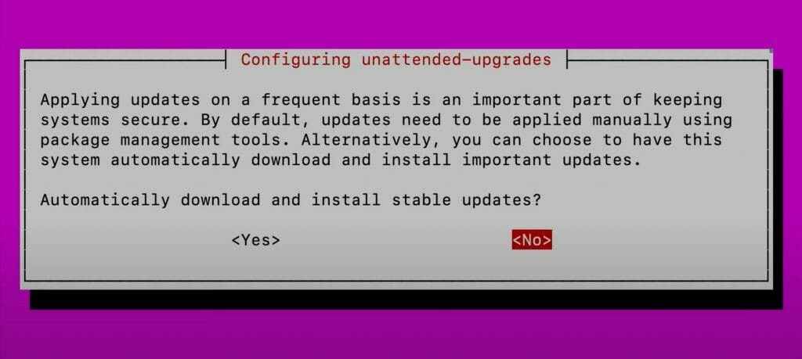

---
### The Conclusion
In the end, this guide should get you ready and set with the basics to begin your Debian journey. Part of the beautiful nature of Linux is the scrappiness it brings out in you, and your truest autodidactic nature comes to the forefront. While ample guides and resources exist for you to learn, you’ll inevitably run into system quirks, which, with time, become more of a puzzle than a panic. Linux is an incredible thing: an operating system truly for the people. The freedom of customization offered by even just a distro like Debian, which is generally considered quite “beginner” (Personally, I don’t believe any distro is truly “beginner” or “advanced”), dwarfs Windows or macOS. Now that you’ve installed your system, whatever you get up to next will be sure to be an adventure.

**Thank you for using my guide.**
